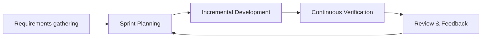
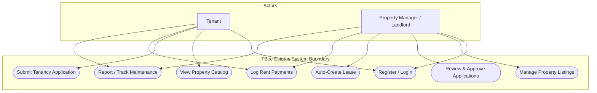
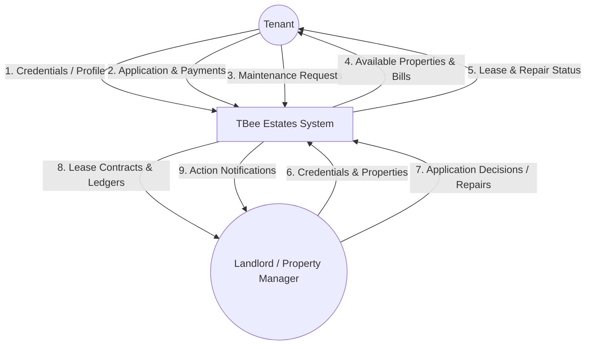
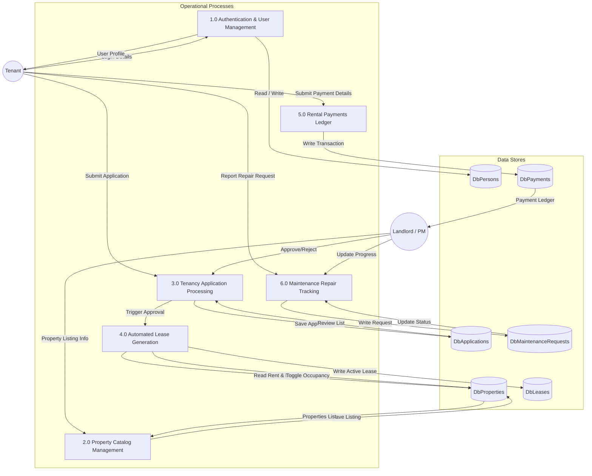
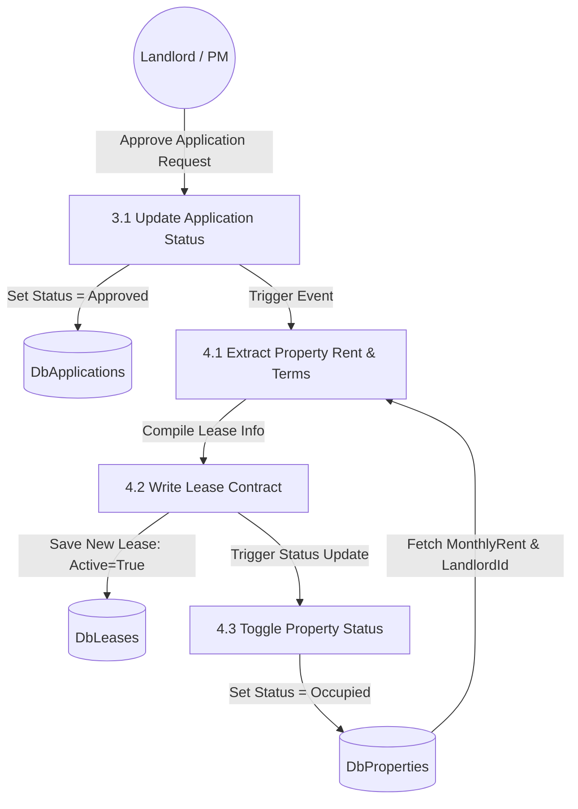
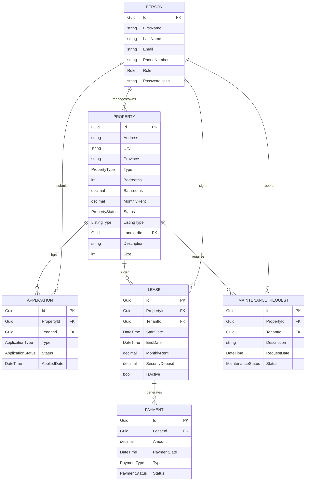
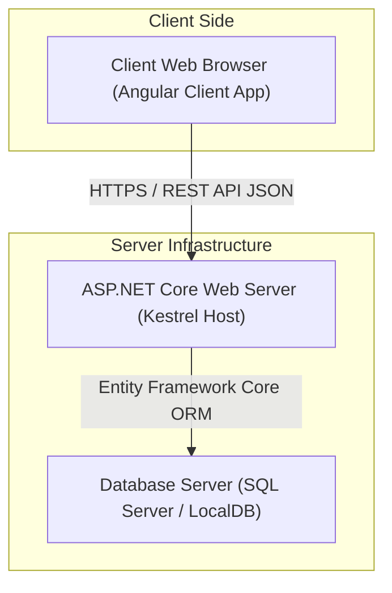
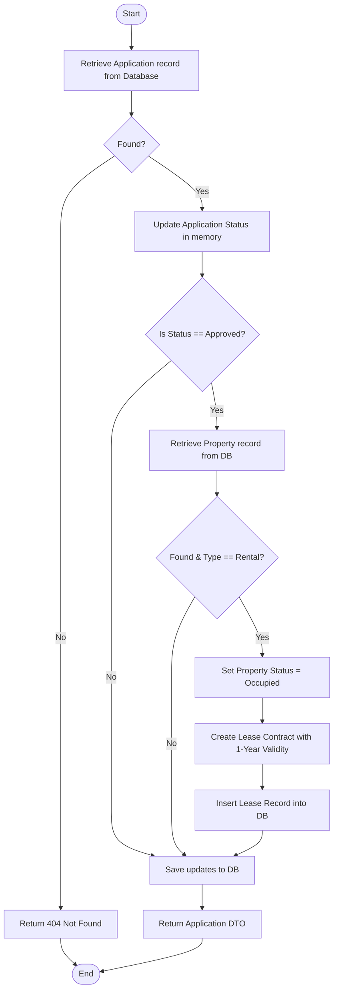
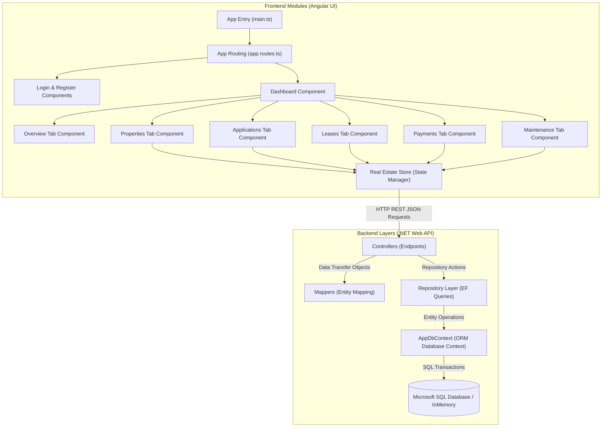

# TBee Estates Real Estate Management System
## Project Documentation & System Design Report

---

## Chapter 1: Introduction

### 1.1 Info About the Organization
**TBee Estates** is a modern, fast-growing real estate agency and property management firm. The organization manages a diverse portfolio of residential properties (such as beachfront apartments, urban lofts, and luxury alpine chalets) and premium commercial spaces. TBee Estates operates by matching landlords with tenants, establishing tenancy leases, collecting rent payments, and maintaining properties through a network of qualified service contractors.

Historically, TBee Estates managed its operations through localized spreadsheets, manual paper forms, and physical logs. However, to sustain its growth and deliver premium customer service, the organization has commissioned the development of the **TBee Estates Real Estate Management System**—a modern, cloud-enabled web application.

---

### 1.2 Objectives
The main objective of the TBee Estates Real Estate Management System is to transition the organization's business workflows from manual paper-based methods to a fully integrated digital ecosystem. Using the **Input-Process-Output-Feedback (IPOF)** framework, the system is designed to achieve the following specific objectives:

#### Objective 1: To capture and list property profiles.
*   **Input**: Property address, city, province, type, dimensions, bedrooms, bathrooms, rent details, and high-definition listing photos.
*   **Process**: Input validation, database serialization, and image asset binding.
*   **Output**: An interactive, filterable catalog of available properties.
*   **Feedback**: Status tags indicating whether a property is "Available" or "Occupied."
*   *Question*: *How can landlords register and edit their properties in the system without relying on administrative middle-men?*

#### Objective 2: To manage user accounts and system access roles.
*   **Input**: User registration profiles (name, email, phone, role selection) and login credentials.
*   **Process**: Secure password hashing (using PBKDF2 or SHA-256 equivalent helper functions) and role-based authentication check.
*   **Output**: Role-customized user sessions for Admins, Landlords, Property Managers, and Tenants.
*   **Feedback**: Dynamic navigation visibility showing only authorized actions to the logged-in user.
*   *Question*: *How can the system safely authenticate users and guarantee that a Tenant cannot access financial properties or landlord management functions?*

#### Objective 3: To process tenancy applications.
*   **Input**: Rental application submissions identifying the property, tenant, and application type.
*   **Process**: Automatic validation of property availability, status tracking, and state modification.
*   **Output**: Standardized application listings visible to landlords and property managers.
*   **Feedback**: Status updates ("Pending", "Approved", "Rejected") sent back to the applicant's dashboard.
*   *Question*: *What workflow enables a tenant to apply for a lease, and how is the review feedback relayed to them?*

#### Objective 4: To automate lease agreement creation.
*   **Input**: Approved tenancy application details, tenancy start/end dates, monthly rent, and security deposit requirements.
*   **Process**: Automatic mapping of application data to generate a new active lease contract.
*   **Output**: A digital lease contract detailing dates, rent, deposits, and active status.
*   **Feedback**: Property occupancy status automatically toggles from "Available" to "Occupied."
*   *Question*: *How can the system guarantee that approving a rental application automatically binds the tenant to a lease without manual paperwork?*

#### Objective 5: To track rental payments.
*   **Input**: Payment entries detailing the lease, payment type (Rent, Security Deposit), amount, and transaction date.
*   **Process**: Transaction ledger recording, mapping to leases, and status validation.
*   **Output**: Financial ledger history and receipt summaries.
*   **Feedback**: Completed status markers updating the tenant's payment tab.
*   *Question*: *How does the system maintain an audit trail of payments received under an active lease?*

#### Objective 6: To manage maintenance request lifecycles.
*   **Input**: Issue descriptions and property references reported by tenants.
*   **Process**: Creating, assigning, and changing the status of maintenance requests.
*   **Output**: Maintenance task tracking board for property managers.
*   **Feedback**: Status changes ("Open", "Resolved") updating the tenant's dashboard view.
*   *Question*: *How can tenants report repairs directly to the system, and how does the management team communicate when they are completed?*

---

### 1.3 Problem Statement
The operational model at TBee Estates before this system's introduction suffered from major limitations:
1.  **Administrative Bottlenecks**: Property managers manually reviewed and filled out paper rental applications. It took days to cross-reference tenant information, check property availability, and type out lease agreements in Microsoft Word.
2.  **Fragmented Records**: Details regarding properties, tenants, and active leases were spread across Excel sheets and paper folders, causing frequent data mismatch issues, untracked lease expiries, and double-booking.
3.  **Untraceable Transactions**: Rental payments were received via cash or direct bank transfers. Tenants sent receipts over messaging applications like WhatsApp, which administrative staff manually typed into ledger sheets. This process led to late payment disputes and reconciliation errors.
4.  **Inefficient Communication**: Maintenance issues were reported via phone calls or texts. Without a central log, issues were frequently forgotten, leading to prolonged unresolved property damage and tenant dissatisfaction.

---

## Chapter 2: Literature Review

To build an efficient custom solution, three alternative approaches to real estate management were studied:

| Feature / Criteria | Zillow | Buildium / AppFolio | Proposed TBee Estates System |
| :--- | :--- | :--- | :--- |
| **Primary Target** | Property listings and search portal. | Enterprise property management firms. | Medium-scale custom property management. |
| **Cost Structure** | Listing fees and ad-sponsored. | Expensive monthly subscription per unit. | Initial custom build cost, zero recurring licensing fees. |
| **Workflow Automation**| Limited to connecting tenants and landlords. | Full lifecycle, but complex setup. | Automated application-to-lease generation logic tailored directly to the firm. |
| **Ease of Customization**| None (rigid public marketplace platform). | Limited API changes (high complexity). | Direct source code modifications (Angular / .NET). |
| **Document Workflows** | Third-party e-sign integrations required. | Core module, but generic contracts. | Immediate automated database-triggered lease creation. |

### Limitations of Existing Systems:
1.  **Zillow**: While excellent for property exposure and listings search, Zillow lacks built-in maintenance management, structured payment histories, and comprehensive lease lifecycle management.
2.  **Enterprise Systems (Buildium/AppFolio)**: These packages are highly detailed, but they are expensive for mid-sized agencies. Their generic configurations do not easily support customized, automatic workflows—such as automatically creating a lease inside the DB and marking the property occupied instantly upon application approval.
3.  **Conclusion**: Developing a dedicated Web API (ASP.NET Core) coupled with a dynamic single-page application (Angular) provides TBee Estates with full data ownership, tailored automated transitions, and an outstanding, premium interface with no recurring licensing overhead.

---

## Chapter 3: Methodology

### 3.1 Methods Used
The project was developed using the **Agile Software Development Lifecycle (SDLC)**. 



Development was divided into 2-week sprints focusing on incremental delivery:
*   **Sprint 1**: Backend database design with EF Core; Authentication and Member APIs.
*   **Sprint 2**: Property Listings Management and Application submission logic.
*   **Sprint 3**: Automated Lease Generation and Payment tracking ledger.
*   **Sprint 4**: Maintenance request portals, Dashboard UI, and responsive styling.

### 3.2 Justification of the Methodology
Agile was chosen for several key reasons:
1.  **Parallel Progress**: The separation between the frontend (Angular) and backend (ASP.NET Core Web API) allowed separate development streams. The API contracts were defined first, permitting mock data integration while the actual SQL schemas were being written.
2.  **Mitigation of Scope Creep**: Weekly reviews with TBee Estates managers ensured that validation rules, roles (Tenant, Landlord, PM), and status workflows matched their operational needs.
3.  **High Adaptability**: During testing, the team realized that manual lease drafting was the longest bottleneck. Agile allowed the immediate prioritization and implementation of the *automated lease generation logic* inside the `ApplicationController`.

### 3.3 Data Gathering Techniques
Before writing code, data was gathered through:
1.  **On-site Workflow Observations**: Shadowing a TBee Estates Property Manager for three days to record the step-by-step actions required to register a property, verify a tenant, write a lease, collect rent, and log a repair.
2.  **Document Analysis**: Collecting and reviewing the physical forms used by the company (Rental Application PDFs, Standard Tenancy Lease templates, and Carbon-copy Rent Receipts) to map database schema properties exactly.
3.  **Interviews**: Interviews were conducted with 2 Landlords and 3 Tenants to determine what information was vital to them (e.g., tenants requested payment history receipts, while landlords prioritized clear property overview metrics).

---

## Chapter 4: System Analysis

### 4.1 Analysis of the Existing System
The existing manual system relied on physical spreadsheets and file cabinets:
*   **Property Registry**: Properties listed on physical folders. Mismatches occurred when units were leased out but the listing was not crossed off.
*   **Application Process**: A tenant filled a paper application. If approved, a PM manually typed tenant info, property rent details, and dates into a Word document lease template. This took up to 3 hours per lease.
*   **Maintenance & Payments**: Payment receipts were photographed and sent via SMS. Request files were handwritten in a notebook, leading to frequent loss of request statuses.

---

### 4.2 Process Modeling Diagrams

#### 4.2.1 Conceptual Use Case Diagram
This diagram outlines the system boundaries and how different actors (Tenant, Landlord, Property Manager) interact with use cases.



---

#### 4.2.2 Data Flow Diagrams (DFDs)
Below is the decomposition of data flows, from Context Level up to Level 2.

##### Level 0: Context Diagram
Illustrates the boundaries of the system, identifying external entities and high-level data flows.



##### Level 1: System Decomposition
This diagram decomposes the system into six core operational processes.



##### Level 2: Detailed Tenancy Application & Lease Automation (Decomposition of Process 3.0 & 4.0)
Shows the detailed, 3rd-level decomposition of the application approval and automatic lease execution workflow.



---

### 4.3 Data Modeling (ERD)
The database structure is normalized and contains relationships mapping properties, leases, applications, maintenance, and payments.



---

### 4.4 Data Dictionaries (DDs)

#### Table 1: Persons
Stores authentication and profile details for all actors.
*   **Primary Key**: `Id` (Unique identifier).

| Column Name | Data Type | Constraint | Description |
| :--- | :--- | :--- | :--- |
| **Id** | Guid | Primary Key, Not Null | Unique identifier for the person. |
| **FirstName** | nvarchar(100) | Not Null | First name of the user. |
| **LastName** | nvarchar(100) | Not Null | Last name of the user. |
| **Email** | nvarchar(256) | Unique, Not Null | Email address used as the login username. |
| **PhoneNumber** | nvarchar(20) | Nullable | Contact phone number. |
| **Role** | int (Enum) | Not Null | System access role: 0 = Admin, 1 = Landlord, 2 = Tenant, 3 = PropertyManager. |
| **PasswordHash** | nvarchar(max) | Not Null | Hashed password. |

#### Table 2: Properties
Stores structural, pricing, and listing status details of units.
*   **Primary Key**: `Id`
*   **Foreign Key**: `LandlordId` references `Persons(Id)` (Restrict delete constraint to prevent deleting landlords with active listings).

| Column Name | Data Type | Constraint | Description |
| :--- | :--- | :--- | :--- |
| **Id** | Guid | Primary Key, Not Null | Unique identifier for the property. |
| **Address** | nvarchar(250) | Not Null | Street address of the property. |
| **City** | nvarchar(100) | Not Null | City location. |
| **Province** | nvarchar(100) | Not Null | Province or state. |
| **Type** | int (Enum) | Not Null | Property classification: 0 = Residential, 1 = Commercial. |
| **Bedrooms** | int | Not Null | Total number of bedroom units. |
| **Bathrooms** | decimal(3,1) | Not Null | Total bathroom count (e.g. 1.5, 2.0). |
| **MonthlyRent** | decimal(18,2) | Not Null | Rental charge per month. |
| **Status** | int (Enum) | Not Null | Occupancy status: 0 = Available, 1 = Occupied. |
| **ListingType** | int (Enum) | Not Null | Listing objective: 0 = ForRent, 1 = ForSale. |
| **LandlordId** | Guid | Foreign Key, Not Null | Links to owner/manager in the Persons table. |
| **Size** | int | Not Null | Property surface area in square feet. |
| **Description** | nvarchar(max) | Nullable | Textual description of property highlights. |

#### Table 3: Applications
Tracks rental and viewing request submissions.
*   **Primary Key**: `Id`
*   **Foreign Keys**: `PropertyId` references `Properties(Id)` (Cascade delete), `TenantId` references `Persons(Id)` (Restrict delete).

| Column Name | Data Type | Constraint | Description |
| :--- | :--- | :--- | :--- |
| **Id** | Guid | Primary Key, Not Null | Unique application ID. |
| **PropertyId** | Guid | Foreign Key, Not Null | Target property reference. |
| **TenantId** | Guid | Foreign Key, Not Null | Applicant identity reference. |
| **Type** | int (Enum) | Not Null | Intention: 0 = Rental, 1 = ViewingRequest, 2 = Purchase. |
| **Status** | int (Enum) | Not Null | Review stage: 0 = Pending, 1 = Approved, 2 = Rejected. |
| **AppliedDate** | datetime2 | Not Null | Timestamp of submission. |

#### Table 4: Leases
Tracks active and expired rental contracts.
*   **Primary Key**: `Id`
*   **Foreign Keys**: `PropertyId` references `Properties(Id)` (Cascade delete), `TenantId` references `Persons(Id)` (Restrict delete).

| Column Name | Data Type | Constraint | Description |
| :--- | :--- | :--- | :--- |
| **Id** | Guid | Primary Key, Not Null | Unique contract identifier. |
| **PropertyId** | Guid | Foreign Key, Not Null | Property leased out. |
| **TenantId** | Guid | Foreign Key, Not Null | Tenant bound by contract. |
| **StartDate** | datetime2 | Not Null | Lease start date. |
| **EndDate** | datetime2 | Not Null | Lease expiry date. |
| **MonthlyRent** | decimal(18,2) | Not Null | Rate locked in contract. |
| **SecurityDeposit**| decimal(18,2) | Not Null | Security deposit amount collected. |
| **IsActive** | bit | Not Null | Status indicator (True = Active, False = Expired). |

#### Table 5: Payments
Logs payments made under leases.
*   **Primary Key**: `Id`
*   **Foreign Key**: `LeaseId` references `Leases(Id)` (Cascade delete).

| Column Name | Data Type | Constraint | Description |
| :--- | :--- | :--- | :--- |
| **Id** | Guid | Primary Key, Not Null | Transaction ID. |
| **LeaseId** | Guid | Foreign Key, Not Null | Associated lease reference. |
| **Amount** | decimal(18,2) | Not Null | Payment amount. |
| **PaymentDate** | datetime2 | Not Null | Timestamp of transaction. |
| **Type** | int (Enum) | Not Null | Category: 0 = Rent, 1 = SecurityDeposit, 2 = Other. |
| **Status** | int (Enum) | Not Null | Status: 0 = Pending, 1 = Completed, 2 = Failed. |

#### Table 6: MaintenanceRequests
Tracks repair requests submitted by tenants.
*   **Primary Key**: `Id`
*   **Foreign Keys**: `PropertyId` references `Properties(Id)` (Cascade delete), `TenantId` references `Persons(Id)` (Restrict delete).

| Column Name | Data Type | Constraint | Description |
| :--- | :--- | :--- | :--- |
| **Id** | Guid | Primary Key, Not Null | Request transaction ID. |
| **PropertyId** | Guid | Foreign Key, Not Null | Affected property address link. |
| **TenantId** | Guid | Foreign Key, Not Null | Submitting tenant link. |
| **Description** | nvarchar(max) | Not Null | Details of the problem. |
| **RequestDate** | datetime2 | Not Null | Date submitted. |
| **Status** | int (Enum) | Not Null | Repair stage: 0 = Open, 1 = InProgress, 2 = Resolved. |

---

## Chapter 5: Design

### 5.1 System Design

#### 5.1.1 Designs => The Solution
The solution is built on a modern **three-tier architecture**:
1.  **Presentation Tier**: Angular Single Page Application (SPA). Operates inside the client's browser, managing state via Angular Signals and sending REST requests via `HttpClient`.
2.  **Application Logic Tier**: ASP.NET Core Web API Controllers. Parses endpoint routes, performs business logic validation, runs transactions, and maps data transfer objects (DTOs).
3.  **Data Storage Tier**: SQL Server managed through Entity Framework Core (Object-Relational Mapper). During testing, it falls back to an InMemory provider to support quick, standalone local execution.

---

#### 5.1.2 Physical DFD
This diagram shows the physical components, protocols, and network connections.



---

#### 5.1.3 User Interfaces
The system provides a sleek, modern UI styled with custom glassmorphism and HSL-based color tokens:
*   **Auth Views (Login/Register)**: Elegant cards with input validation. Users select their role (Tenant, Landlord, PM) during registration, configuring their user permissions.
*   **Property Catalog**: Grid layout displaying property cards with size, location, bed/bath count, and pricing.
*   **User Dashboard**: Includes a sidebar navigation linking to tab components:
    *   **Overview Tab**: Displays KPI cards (e.g., total properties, active leases, monthly revenue graph).
    *   **Properties Tab**: Allows landlords/managers to list new properties and select image files.
    *   **Applications Tab**: Displays submitted applications. Landlords can review and click "Approve" or "Reject".
    *   **Leases Tab**: Displays active contract periods and terms.
    *   **Payments Tab**: Displays payment histories.
    *   **Maintenance Tab**: Lists tenant maintenance tickets. Includes a status modifier to set requests to "Resolved."

---

### 5.2 Program Design

#### 5.2.1 Pseudocodes

##### Algorithm 1: User Login Authentication
```text
FUNCTION LoginUser(email, password)
    // 1. Fetch user records matching the email
    user = Database.Persons.GetByEmail(email)
    IF user IS NULL THEN
        RETURN Error("Invalid email or password.")
    ENDIF
    
    // 2. Hash and compare passwords
    passwordIsValid = PasswordHasher.Verify(password, user.PasswordHash)
    IF passwordIsValid IS FALSE THEN
        RETURN Error("Invalid email or password.")
    ENDIF
    
    // 3. Construct user session details
    sessionDto = CreateSessionDto(user.Id, user.FirstName, user.LastName, user.Role)
    RETURN Success(sessionDto)
ENDFUNCTION
```

##### Algorithm 2: Property Creation Listing
```text
FUNCTION CreatePropertyListing(propertyData, files)
    IF propertyData.Address IS EMPTY OR propertyData.MonthlyRent <= 0 THEN
        RETURN Error("Validation failed. Address and rent details are required.")
    ENDIF
    
    // Convert files to base64 Data URLs for DB storage
    imageUrlsList = NEW List()
    FOR EACH file IN files DO
        dataUrl = ReadFileAsDataUrl(file)
        imageUrlsList.Add(dataUrl)
    ENDFOR
    
    property = NEW Property()
    property.Id = GenerateNewGuid()
    property.Address = propertyData.Address
    property.City = propertyData.City
    property.Province = propertyData.Province
    property.Type = propertyData.Type
    property.MonthlyRent = propertyData.MonthlyRent
    property.LandlordId = propertyData.LandlordId
    property.ImageUrls = imageUrlsList
    property.Status = PropertyStatus.Available
    
    Database.Properties.Add(property)
    Database.SaveChanges()
    
    RETURN Success(property)
ENDFUNCTION
```

##### Algorithm 3: Automated Lease Creation (Inside `ApplicationController.cs`)
```text
FUNCTION UpdateApplicationStatus(applicationId, newStatus)
    application = Database.Applications.GetById(applicationId)
    IF application IS NULL THEN
        RETURN Error("Application not found.")
    ENDIF
    
    application.Status = newStatus
    Database.Applications.Update(application)
    
    // Execute automation only upon approval
    IF newStatus IS ApplicationStatus.Approved THEN
        property = Database.Properties.GetById(application.PropertyId)
        IF property IS NOT NULL THEN
            IF application.Type IS ApplicationType.Rental THEN
                // 1. Mark property as Occupied
                property.Status = PropertyStatus.Occupied
                Database.Properties.Update(property)
                
                // 2. Instantiate new Lease agreement automatically
                lease = NEW Lease()
                lease.Id = GenerateNewGuid()
                lease.PropertyId = property.Id
                lease.TenantId = application.TenantId
                lease.StartDate = DateTime.UtcNow
                lease.EndDate = DateTime.UtcNow.AddYears(1)
                lease.MonthlyRent = property.MonthlyRent
                lease.SecurityDeposit = property.MonthlyRent
                lease.IsActive = True
                
                Database.Leases.Add(lease)
            ENDIF
        ENDIF
    ENDIF
    
    Database.SaveChanges()
    RETURN Success(application)
ENDFUNCTION
```

---

#### 5.2.2 Flowcharts

##### Application Approval and Automated Lease Execution Flow
The following flowchart illustrates the automated database operations performed by the backend server when an application is approved.



---

#### 5.2.3 Structure Charts
The system's modular structure is divided into frontend client structures and backend service layers.



---

## Chapter 6: Implementation

### 6.1 User Manual

#### 6.1.1 Tenant Portal Guide
1.  **Account Registration**: Visit the register page (`/register`), fill out your name, contact details, and choose the role **Tenant**. Submit the form.
2.  **Browse Listings**: Go to the homepage catalog. Filter and search for desired locations, types, or price points.
3.  **Submit Applications**: Select a property listing, click **Apply**, select application type (e.g. *Rental*), and submit.
4.  **Review Applications and Leases**: Open your **Dashboard** and select the **Applications** tab to view updates. Once approved, the **Leases** tab will display your active tenancy contracts.
5.  **Submit Payments**: Access the **Payments** tab. Input payment amounts and submit them.
6.  **Report Repairs**: Open the **Maintenance** tab, fill out a description of the issue (e.g., leaking faucet), and click **Submit Request**. Monitor progress markers.

#### 6.1.2 Landlord & Property Manager Portal Guide
1.  **Add Listings**: Open your Dashboard, navigate to the **Properties** tab. Enter details (address, city, size, monthly rent) and select property photos. Click **Submit Property**.
2.  **Review Applications**: Go to the **Applications** tab to view tenant applications. Click **Approve** on valid requests to automatically establish lease records.
3.  **Monitor Financials**: Access the **Overview** tab for a summary of active leases, total rental income, and properties count. Open the **Payments** tab to audit individual rent receipts.
4.  **Manage Repairs**: Go to the **Maintenance** tab, view reported issues, and update statuses to **Resolved** once contractors complete repairs.

---

### 6.2 Technical Manual

#### 6.2.1 System Requirements
*   **Operating System**: Windows 10/11, macOS, or Linux.
*   **SDK & Runtimes**: .NET 9.0 SDK, Node.js v18.0+.
*   **Database Engine**: Microsoft SQL Server (LocalDB or Express Edition) or InMemory Database fallback.
*   **Tooling**: PowerShell or Terminal, Visual Studio Code / Visual Studio 2022.

#### 6.2.2 Installation & Startup Instructions

##### Step 1: Clone and Configure the Backend API
1. Open PowerShell or a terminal inside the workspace directory (`c:\Source\Real Estate`).
2. Run the restore command to resolve package dependencies:
   ```bash
   dotnet restore
   ```
3. Run the backend Web API:
   ```bash
   dotnet run
   ```
   *Note: On startup, the system checks connection strings. If a database is not configured, it defaults to a built-in InMemory provider, automatically seeds sample data, and launches Swagger UI at `http://localhost:5000` (or dynamic SSL port).*

##### Step 2: Configure the Angular Frontend
1. Open a new terminal in the frontend directory (`c:\Source\Real Estate\Frontend`).
2. Install npm dependencies:
   ```bash
   npm install
   ```
3. Launch the development server:
   ```bash
   npm start
   ```
4. Access the web interface in your browser at `http://localhost:4200`.

##### Step 3: Test Accounts (Pre-seeded Data)
Use the credentials below to log in and test different system roles:
*   **Property Manager**: `marcus.pm@tbeeestates.com` | Password: `Password123!`
*   **Landlord**: `jane.doe@realestate.com` | Password: `Password123!`
*   **Tenant 1**: `john.smith@gmail.com` | Password: `Password123!`
*   **Tenant 2**: `alice.cooper@gmail.com` | Password: `Password123!`
